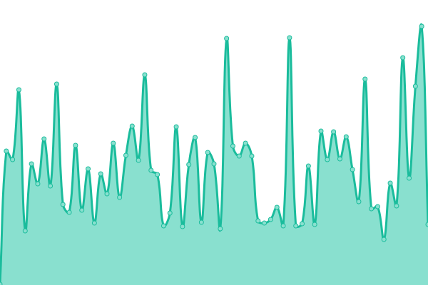

# [📈 Live Status](https://qwertydev1.github.io/rammerhead-uptime): <!--live status--> **🟥 Complete outage**

This repository contains the open-source uptime monitor and status page for [qwertyhtml](https://qwertydev1.github.io/rammerhead-uptime), powered by [Upptime](https://github.com/upptime/upptime).

With [Upptime](https://upptime.js.org), you can get your own unlimited and free uptime monitor and status page, powered entirely by a GitHub repository. We use [Issues](https://github.com/qwertydev1/rammerhead-uptime/issues) as incident reports, [Actions](https://github.com/qwertydev1/rammerhead-uptime/actions) as uptime monitors, and [Pages](https://qwertydev1.github.io/rammerhead-uptime) for the status page.

<!--start: status pages-->
<!-- This summary is generated by Upptime (https://github.com/upptime/upptime) -->
<!-- Do not edit this manually, your changes will be overwritten -->
<!-- prettier-ignore -->
| URL | Status | History | Response Time | Uptime |
| --- | ------ | ------- | ------------- | ------ |
|  [rammerhead](https://direct2.rammerhead.org/) | 🟥 Down | [rammerhead.yml](https://github.com/qwertydev1/rammerhead-uptime/commits/HEAD/history/rammerhead.yml) | 

 165ms
     
 | 

<a href="https://qwertydev1.github.io/rammerhead-uptime/history/rammerhead">100.00%</a>
    

|  [rammerhead](https://direct.rammerhead.org/) | 🟥 Down | [rammerhead.yml](https://github.com/qwertydev1/rammerhead-uptime/commits/HEAD/history/rammerhead.yml) | 

 165ms
     
 | 

<a href="https://qwertydev1.github.io/rammerhead-uptime/history/rammerhead">100.00%</a>
    

|  [rammerhead](https://ram.thefemboy.gay/) | 🟥 Down | [rammerhead.yml](https://github.com/qwertydev1/rammerhead-uptime/commits/HEAD/history/rammerhead.yml) | 

 165ms
     
 | 

<a href="https://qwertydev1.github.io/rammerhead-uptime/history/rammerhead">100.00%</a>
    

|  [rammerhead](https://browser.rammerhead.org/) | 🟥 Down | [rammerhead.yml](https://github.com/qwertydev1/rammerhead-uptime/commits/HEAD/history/rammerhead.yml) | 

 165ms
     
 | 

<a href="https://qwertydev1.github.io/rammerhead-uptime/history/rammerhead">100.00%</a>
    

|  [rammerhead](https://rammerhead.midnightofficial.xyz/) | 🟥 Down | [rammerhead.yml](https://github.com/qwertydev1/rammerhead-uptime/commits/HEAD/history/rammerhead.yml) | 

 165ms
     
 | 

<a href="https://qwertydev1.github.io/rammerhead-uptime/history/rammerhead">100.00%</a>
    

|  [rammerhead](https://a.midnightofficial.xyz/) | 🟥 Down | [rammerhead.yml](https://github.com/qwertydev1/rammerhead-uptime/commits/HEAD/history/rammerhead.yml) | 

 165ms
     
 | 

<a href="https://qwertydev1.github.io/rammerhead-uptime/history/rammerhead">100.00%</a>
    

|  [rammerhead](https://r.midnightofficial.xyz/) | 🟥 Down | [rammerhead.yml](https://github.com/qwertydev1/rammerhead-uptime/commits/HEAD/history/rammerhead.yml) | 

 165ms
     
 | 

<a href="https://qwertydev1.github.io/rammerhead-uptime/history/rammerhead">100.00%</a>
    

|  [rammerhead](https://e.midnightofficial.xyz/) | 🟥 Down | [rammerhead.yml](https://github.com/qwertydev1/rammerhead-uptime/commits/HEAD/history/rammerhead.yml) | 

 165ms
     
 | 

<a href="https://qwertydev1.github.io/rammerhead-uptime/history/rammerhead">100.00%</a>
    

|  [rammerhead](https://rh.midnightofficial.xyz/) | 🟥 Down | [rammerhead.yml](https://github.com/qwertydev1/rammerhead-uptime/commits/HEAD/history/rammerhead.yml) | 

 165ms
     
 | 

<a href="https://qwertydev1.github.io/rammerhead-uptime/history/rammerhead">100.00%</a>
    

|  [rammerhead](https://r.lucidofficial.xyz/) | 🟥 Down | [rammerhead.yml](https://github.com/qwertydev1/rammerhead-uptime/commits/HEAD/history/rammerhead.yml) | 

 165ms
     
 | 

<a href="https://qwertydev1.github.io/rammerhead-uptime/history/rammerhead">100.00%</a>
    

|  [rammerhead](https://r.apexhcf.xyz/) | 🟥 Down | [rammerhead.yml](https://github.com/qwertydev1/rammerhead-uptime/commits/HEAD/history/rammerhead.yml) | 

 165ms
     
 | 

<a href="https://qwertydev1.github.io/rammerhead-uptime/history/rammerhead">100.00%</a>
    

|  [rammerhead](https://r.kahoot.click/) | 🟥 Down | [rammerhead.yml](https://github.com/qwertydev1/rammerhead-uptime/commits/HEAD/history/rammerhead.yml) | 

 165ms
     
 | 

<a href="https://qwertydev1.github.io/rammerhead-uptime/history/rammerhead">100.00%</a>
    

|  [rammerhead](https://r.pyro.bar/) | 🟥 Down | [rammerhead.yml](https://github.com/qwertydev1/rammerhead-uptime/commits/HEAD/history/rammerhead.yml) | 

 165ms
     
 | 

<a href="https://qwertydev1.github.io/rammerhead-uptime/history/rammerhead">100.00%</a>
    

|  [rammerhead](https://sso.prodigygame.online/) | 🟥 Down | [rammerhead.yml](https://github.com/qwertydev1/rammerhead-uptime/commits/HEAD/history/rammerhead.yml) | 

 165ms
     
 | 

<a href="https://qwertydev1.github.io/rammerhead-uptime/history/rammerhead">100.00%</a>
    

|  [rammerhead](https://rm.triway.live/) | 🟥 Down | [rammerhead.yml](https://github.com/qwertydev1/rammerhead-uptime/commits/HEAD/history/rammerhead.yml) | 

 165ms
     
 | 

<a href="https://qwertydev1.github.io/rammerhead-uptime/history/rammerhead">100.00%</a>
    

|  [rammerhead](https://afsgderdfegtdfsewrdfserdgcvxdsfegrfbcv.ruralanemone.tech/) | 🟥 Down | [rammerhead.yml](https://github.com/qwertydev1/rammerhead-uptime/commits/HEAD/history/rammerhead.yml) | 

 165ms
     
 | 

<a href="https://qwertydev1.github.io/rammerhead-uptime/history/rammerhead">100.00%</a>
    

|  [rammerhead](https://yee.ruralanemone.tech/) | 🟥 Down | [rammerhead.yml](https://github.com/qwertydev1/rammerhead-uptime/commits/HEAD/history/rammerhead.yml) | 

 165ms
     
 | 

<a href="https://qwertydev1.github.io/rammerhead-uptime/history/rammerhead">100.00%</a>
    

|  [rammerhead](https://xmr.luph.cc/) | 🟥 Down | [rammerhead.yml](https://github.com/qwertydev1/rammerhead-uptime/commits/HEAD/history/rammerhead.yml) | 

 165ms
     
 | 

<a href="https://qwertydev1.github.io/rammerhead-uptime/history/rammerhead">100.00%</a>
    

|  [rammerhead](https://use.matrix.luph.lol/) | 🟥 Down | [rammerhead.yml](https://github.com/qwertydev1/rammerhead-uptime/commits/HEAD/history/rammerhead.yml) | 

 165ms
     
 | 

<a href="https://qwertydev1.github.io/rammerhead-uptime/history/rammerhead">100.00%</a>
    

|  [rammerhead](https://r.generalmathematics.net/) | 🟥 Down | [rammerhead.yml](https://github.com/qwertydev1/rammerhead-uptime/commits/HEAD/history/rammerhead.yml) | 

 165ms
     
 | 

<a href="https://qwertydev1.github.io/rammerhead-uptime/history/rammerhead">100.00%</a>
    

|  [rammerhead](https://legit.studyschooltoday.eu.org/) | 🟥 Down | [rammerhead.yml](https://github.com/qwertydev1/rammerhead-uptime/commits/HEAD/history/rammerhead.yml) | 

 165ms
     
 | 

<a href="https://qwertydev1.github.io/rammerhead-uptime/history/rammerhead">100.00%</a>
    

|  [rammerhead](https://sussybaka.studyschooltoday.eu.org/) | 🟥 Down | [rammerhead.yml](https://github.com/qwertydev1/rammerhead-uptime/commits/HEAD/history/rammerhead.yml) | 

 165ms
     
 | 

<a href="https://qwertydev1.github.io/rammerhead-uptime/history/rammerhead">100.00%</a>
    

|  [rammerhead](https://pickmysubdomaininchat.studyschooltoday.eu.org/) | 🟥 Down | [rammerhead.yml](https://github.com/qwertydev1/rammerhead-uptime/commits/HEAD/history/rammerhead.yml) | 

 165ms
     
 | 

<a href="https://qwertydev1.github.io/rammerhead-uptime/history/rammerhead">100.00%</a>
    

|  [rammerhead](https://my.name.is.john.cenaa.studyschooltoday.eu.org/) | 🟥 Down | [rammerhead.yml](https://github.com/qwertydev1/rammerhead-uptime/commits/HEAD/history/rammerhead.yml) | 

 165ms
     
 | 

<a href="https://qwertydev1.github.io/rammerhead-uptime/history/rammerhead">100.00%</a>
    

|  [rammerhead](https://r.utopia.education/) | 🟥 Down | [rammerhead.yml](https://github.com/qwertydev1/rammerhead-uptime/commits/HEAD/history/rammerhead.yml) | 

 165ms
     
 | 

<a href="https://qwertydev1.github.io/rammerhead-uptime/history/rammerhead">100.00%</a>
    

|  [rammerhead](https://r.utopiaunblocker.org/) | 🟥 Down | [rammerhead.yml](https://github.com/qwertydev1/rammerhead-uptime/commits/HEAD/history/rammerhead.yml) | 

 165ms
     
 | 

<a href="https://qwertydev1.github.io/rammerhead-uptime/history/rammerhead">100.00%</a>
    

|  [rammerhead](https://r.utopiaworld.ink/) | 🟥 Down | [rammerhead.yml](https://github.com/qwertydev1/rammerhead-uptime/commits/HEAD/history/rammerhead.yml) | 

 165ms
     
 | 

<a href="https://qwertydev1.github.io/rammerhead-uptime/history/rammerhead">100.00%</a>
    

|  [rammerhead](https://rh.aluminumnetwork.xyz/) | 🟥 Down | [rammerhead.yml](https://github.com/qwertydev1/rammerhead-uptime/commits/HEAD/history/rammerhead.yml) | 

 165ms
     
 | 

<a href="https://qwertydev1.github.io/rammerhead-uptime/history/rammerhead">100.00%</a>
    

|  [rammerhead](https://r.aluminumnetwork.xyz/) | 🟥 Down | [rammerhead.yml](https://github.com/qwertydev1/rammerhead-uptime/commits/HEAD/history/rammerhead.yml) | 

 165ms
     
 | 

<a href="https://qwertydev1.github.io/rammerhead-uptime/history/rammerhead">100.00%</a>
    

|  [rammerhead](https://r.weeb-central.icu/) | 🟥 Down | [rammerhead.yml](https://github.com/qwertydev1/rammerhead-uptime/commits/HEAD/history/rammerhead.yml) | 

 165ms
     
 | 

<a href="https://qwertydev1.github.io/rammerhead-uptime/history/rammerhead">100.00%</a>
    

|  [rammerhead](https://direct.weeb-central.icu/) | 🟥 Down | [rammerhead.yml](https://github.com/qwertydev1/rammerhead-uptime/commits/HEAD/history/rammerhead.yml) | 

 165ms
     
 | 

<a href="https://qwertydev1.github.io/rammerhead-uptime/history/rammerhead">100.00%</a>
    

|  [rammerhead](https://rh.weeb-central.icu/) | 🟥 Down | [rammerhead.yml](https://github.com/qwertydev1/rammerhead-uptime/commits/HEAD/history/rammerhead.yml) | 

 165ms
     
 | 

<a href="https://qwertydev1.github.io/rammerhead-uptime/history/rammerhead">100.00%</a>
    

|  [rammerhead](https://ram.weeb-central.icu/) | 🟥 Down | [rammerhead.yml](https://github.com/qwertydev1/rammerhead-uptime/commits/HEAD/history/rammerhead.yml) | 

 165ms
     
 | 

<a href="https://qwertydev1.github.io/rammerhead-uptime/history/rammerhead">100.00%</a>
    

|  [rammerhead](https://sso.weeb-central.icu/) | 🟥 Down | [rammerhead.yml](https://github.com/qwertydev1/rammerhead-uptime/commits/HEAD/history/rammerhead.yml) | 

 165ms
     
 | 

<a href="https://qwertydev1.github.io/rammerhead-uptime/history/rammerhead">100.00%</a>
    

|  [rammerhead](https://r.studyschooltoday.eu.org/) | 🟥 Down | [rammerhead.yml](https://github.com/qwertydev1/rammerhead-uptime/commits/HEAD/history/rammerhead.yml) | 

 165ms
     
 | 

<a href="https://qwertydev1.github.io/rammerhead-uptime/history/rammerhead">100.00%</a>
    

|  [rammerhead](https://desp.icable.me/) | 🟥 Down | [rammerhead.yml](https://github.com/qwertydev1/rammerhead-uptime/commits/HEAD/history/rammerhead.yml) | 

 165ms
     
 | 

<a href="https://qwertydev1.github.io/rammerhead-uptime/history/rammerhead">100.00%</a>
    

|  [rammerhead](https://bananaboat.me/) | 🟥 Down | [rammerhead.yml](https://github.com/qwertydev1/rammerhead-uptime/commits/HEAD/history/rammerhead.yml) | 

 165ms
     
 | 

<a href="https://qwertydev1.github.io/rammerhead-uptime/history/rammerhead">100.00%</a>
    

|  [rammerhead](https://rammer.camdvr.org/) | 🟥 Down | [rammerhead.yml](https://github.com/qwertydev1/rammerhead-uptime/commits/HEAD/history/rammerhead.yml) | 

 165ms
     
 | 

<a href="https://qwertydev1.github.io/rammerhead-uptime/history/rammerhead">100.00%</a>
    

|  [rammerhead](https://rammer.ooguy.com/) | 🟥 Down | [rammerhead.yml](https://github.com/qwertydev1/rammerhead-uptime/commits/HEAD/history/rammerhead.yml) | 

 165ms
     
 | 

<a href="https://qwertydev1.github.io/rammerhead-uptime/history/rammerhead">100.00%</a>
    

|  [rammerhead](https://rammer.giize.com/) | 🟥 Down | [rammerhead.yml](https://github.com/qwertydev1/rammerhead-uptime/commits/HEAD/history/rammerhead.yml) | 

 165ms
     
 | 

<a href="https://qwertydev1.github.io/rammerhead-uptime/history/rammerhead">100.00%</a>
    

|  [rammerhead](https://rammer.loseyourip.com/) | 🟥 Down | [rammerhead.yml](https://github.com/qwertydev1/rammerhead-uptime/commits/HEAD/history/rammerhead.yml) | 

 165ms
     
 | 

<a href="https://qwertydev1.github.io/rammerhead-uptime/history/rammerhead">100.00%</a>
    

|  [rammerhead](https://rh.titannetwork.info/) | 🟥 Down | [rammerhead.yml](https://github.com/qwertydev1/rammerhead-uptime/commits/HEAD/history/rammerhead.yml) | 

 165ms
     
 | 

<a href="https://qwertydev1.github.io/rammerhead-uptime/history/rammerhead">100.00%</a>
    

|  [rammerhead](https://empowerlearning.titannetwork.info/) | 🟥 Down | [rammerhead.yml](https://github.com/qwertydev1/rammerhead-uptime/commits/HEAD/history/rammerhead.yml) | 

 165ms
     
 | 

<a href="https://qwertydev1.github.io/rammerhead-uptime/history/rammerhead">100.00%</a>
    

|  [rammerhead](https://enrichingstudents.titannetwork.info/) | 🟥 Down | [rammerhead.yml](https://github.com/qwertydev1/rammerhead-uptime/commits/HEAD/history/rammerhead.yml) | 

 165ms
     
 | 

<a href="https://qwertydev1.github.io/rammerhead-uptime/history/rammerhead">100.00%</a>
    

|  [rammerhead](https://googleclassroom.titannetwork.info/) | 🟥 Down | [rammerhead.yml](https://github.com/qwertydev1/rammerhead-uptime/commits/HEAD/history/rammerhead.yml) | 

 165ms
     
 | 

<a href="https://qwertydev1.github.io/rammerhead-uptime/history/rammerhead">100.00%</a>
    

|  [rammerhead](https://cloudflare.rammerhead.org/) | 🟥 Down | [rammerhead.yml](https://github.com/qwertydev1/rammerhead-uptime/commits/HEAD/history/rammerhead.yml) | 

 165ms
     
 | 

<a href="https://qwertydev1.github.io/rammerhead-uptime/history/rammerhead">100.00%</a>
    

|  [rammerhead](https://rammerhead.morrowseer.xyz/) | 🟥 Down | [rammerhead.yml](https://github.com/qwertydev1/rammerhead-uptime/commits/HEAD/history/rammerhead.yml) | 

 165ms
     
 | 

<a href="https://qwertydev1.github.io/rammerhead-uptime/history/rammerhead">100.00%</a>
    

|  [rammerhead](https://poodle.xn--unup4y/) | 🟥 Down | [rammerhead.yml](https://github.com/qwertydev1/rammerhead-uptime/commits/HEAD/history/rammerhead.yml) | 

 165ms
     
 | 

<a href="https://qwertydev1.github.io/rammerhead-uptime/history/rammerhead">100.00%</a>
    

|  [rammerhead](https://rx.blackxfiied.xyz/) | 🟥 Down | [rammerhead.yml](https://github.com/qwertydev1/rammerhead-uptime/commits/HEAD/history/rammerhead.yml) | 

 165ms
     
 | 

<a href="https://qwertydev1.github.io/rammerhead-uptime/history/rammerhead">100.00%</a>
    

|  [rammerhead](https://ram.motortruck1221.tech/) | 🟥 Down | [rammerhead.yml](https://github.com/qwertydev1/rammerhead-uptime/commits/HEAD/history/rammerhead.yml) | 

 165ms
     
 | 

<a href="https://qwertydev1.github.io/rammerhead-uptime/history/rammerhead">100.00%</a>
    

|  [rammerhead](https://rh.motortruck1221.me/) | 🟥 Down | [rammerhead.yml](https://github.com/qwertydev1/rammerhead-uptime/commits/HEAD/history/rammerhead.yml) | 

 165ms
     
 | 

<a href="https://qwertydev1.github.io/rammerhead-uptime/history/rammerhead">100.00%</a>
    

|  [rammerhead](https://rd.globalcentauri.tech/) | 🟥 Down | [rammerhead.yml](https://github.com/qwertydev1/rammerhead-uptime/commits/HEAD/history/rammerhead.yml) | 

 165ms
     
 | 

<a href="https://qwertydev1.github.io/rammerhead-uptime/history/rammerhead">100.00%</a>
    

|  [rammerhead](https://ramming.xan.lol/) | 🟥 Down | [rammerhead.yml](https://github.com/qwertydev1/rammerhead-uptime/commits/HEAD/history/rammerhead.yml) | 

 165ms
     
 | 

<a href="https://qwertydev1.github.io/rammerhead-uptime/history/rammerhead">100.00%</a>
    

|  [rammerhead](https://rh.naruto.tech/) | 🟥 Down | [rammerhead.yml](https://github.com/qwertydev1/rammerhead-uptime/commits/HEAD/history/rammerhead.yml) | 

 165ms
     
 | 

<a href="https://qwertydev1.github.io/rammerhead-uptime/history/rammerhead">100.00%</a>
    

|  [rammerhead](https://pwoxywoxy.xan.lol/) | 🟥 Down | [rammerhead.yml](https://github.com/qwertydev1/rammerhead-uptime/commits/HEAD/history/rammerhead.yml) | 

 165ms
     
 | 

<a href="https://qwertydev1.github.io/rammerhead-uptime/history/rammerhead">100.00%</a>
    

|  [rammerhead](https://rh.lhost.dev/) | 🟥 Down | [rammerhead.yml](https://github.com/qwertydev1/rammerhead-uptime/commits/HEAD/history/rammerhead.yml) | 

 165ms
     
 | 

<a href="https://qwertydev1.github.io/rammerhead-uptime/history/rammerhead">100.00%</a>
    

|  [rammerhead](https://chrome.lhost.dev/) | 🟥 Down | [rammerhead.yml](https://github.com/qwertydev1/rammerhead-uptime/commits/HEAD/history/rammerhead.yml) | 

 165ms
     
 | 

<a href="https://qwertydev1.github.io/rammerhead-uptime/history/rammerhead">100.00%</a>
    

|  [rammerhead](https://blocked.lhost.dev/) | 🟥 Down | [rammerhead.yml](https://github.com/qwertydev1/rammerhead-uptime/commits/HEAD/history/rammerhead.yml) | 

 165ms
     
 | 

<a href="https://qwertydev1.github.io/rammerhead-uptime/history/rammerhead">100.00%</a>
    

|  [rammerhead](https://tabs.lhost.dev/) | 🟥 Down | [rammerhead.yml](https://github.com/qwertydev1/rammerhead-uptime/commits/HEAD/history/rammerhead.yml) | 

 165ms
     
 | 

<a href="https://qwertydev1.github.io/rammerhead-uptime/history/rammerhead">100.00%</a>
    

|  [rammerhead](https://r.willuna.live/) | 🟥 Down | [rammerhead.yml](https://github.com/qwertydev1/rammerhead-uptime/commits/HEAD/history/rammerhead.yml) | 

 165ms
     
 | 

<a href="https://qwertydev1.github.io/rammerhead-uptime/history/rammerhead">100.00%</a>
    

|  [rammerhead](https://direct3.rammerhead.org/) | 🟥 Down | [rammerhead.yml](https://github.com/qwertydev1/rammerhead-uptime/commits/HEAD/history/rammerhead.yml) | 

 165ms
     
 | 

<a href="https://qwertydev1.github.io/rammerhead-uptime/history/rammerhead">100.00%</a>
    

|  [rammerhead](https://rh.lwaid.dev/) | 🟥 Down | [rammerhead.yml](https://github.com/qwertydev1/rammerhead-uptime/commits/HEAD/history/rammerhead.yml) | 

 165ms
     
 | 

<a href="https://qwertydev1.github.io/rammerhead-uptime/history/rammerhead">100.00%</a>
    

|  [rammerhead](https://direct4.rammerhead.org/) | 🟥 Down | [rammerhead.yml](https://github.com/qwertydev1/rammerhead-uptime/commits/HEAD/history/rammerhead.yml) | 

 165ms
     
 | 

<a href="https://qwertydev1.github.io/rammerhead-uptime/history/rammerhead">100.00%</a>
    

|  [rammerhead](https://direct5.rammerhead.org/) | 🟥 Down | [rammerhead.yml](https://github.com/qwertydev1/rammerhead-uptime/commits/HEAD/history/rammerhead.yml) | 

 165ms
     
 | 

<a href="https://qwertydev1.github.io/rammerhead-uptime/history/rammerhead">100.00%</a>
    

|  [rammerhead](https://rammerhead.yitzib.me/) | 🟥 Down | [rammerhead.yml](https://github.com/qwertydev1/rammerhead-uptime/commits/HEAD/history/rammerhead.yml) | 

 165ms
     
 | 

<a href="https://qwertydev1.github.io/rammerhead-uptime/history/rammerhead">100.00%</a>
    

|  [rammerhead](https://not.my.actual.name.yitzib.me/) | 🟥 Down | [rammerhead.yml](https://github.com/qwertydev1/rammerhead-uptime/commits/HEAD/history/rammerhead.yml) | 

 165ms
     
 | 

<a href="https://qwertydev1.github.io/rammerhead-uptime/history/rammerhead">100.00%</a>
    

|  [rammerhead](https://r.yitzib.me/) | 🟥 Down | [rammerhead.yml](https://github.com/qwertydev1/rammerhead-uptime/commits/HEAD/history/rammerhead.yml) | 

 165ms
     
 | 

<a href="https://qwertydev1.github.io/rammerhead-uptime/history/rammerhead">100.00%</a>
    

|  [rammerhead](https://im.not.r.aci.st/) | 🟥 Down | [rammerhead.yml](https://github.com/qwertydev1/rammerhead-uptime/commits/HEAD/history/rammerhead.yml) | 

 165ms
     
 | 

<a href="https://qwertydev1.github.io/rammerhead-uptime/history/rammerhead">100.00%</a>
    

|  [rammerhead](https://breadtw.ink/) | 🟥 Down | [rammerhead.yml](https://github.com/qwertydev1/rammerhead-uptime/commits/HEAD/history/rammerhead.yml) | 

 165ms
     
 | 

<a href="https://qwertydev1.github.io/rammerhead-uptime/history/rammerhead">100.00%</a>
    

|  [rammerhead](https://against.the.gra.im/) | 🟥 Down | [rammerhead.yml](https://github.com/qwertydev1/rammerhead-uptime/commits/HEAD/history/rammerhead.yml) | 

 165ms
     
 | 

<a href="https://qwertydev1.github.io/rammerhead-uptime/history/rammerhead">100.00%</a>
    

|  [rammerhead](https://r.il.ax/) | 🟥 Down | [rammerhead.yml](https://github.com/qwertydev1/rammerhead-uptime/commits/HEAD/history/rammerhead.yml) | 

 165ms
     
 | 

<a href="https://qwertydev1.github.io/rammerhead-uptime/history/rammerhead">100.00%</a>
    

|  [rammerhead](https://link2.viewdns.net/) | 🟥 Down | [rammerhead.yml](https://github.com/qwertydev1/rammerhead-uptime/commits/HEAD/history/rammerhead.yml) | 

 165ms
     
 | 

<a href="https://qwertydev1.github.io/rammerhead-uptime/history/rammerhead">100.00%</a>
    

|  [rammerhead](https://rammerhead.izooc.ninja/) | 🟥 Down | [rammerhead.yml](https://github.com/qwertydev1/rammerhead-uptime/commits/HEAD/history/rammerhead.yml) | 

 165ms
     
 | 

<a href="https://qwertydev1.github.io/rammerhead-uptime/history/rammerhead">100.00%</a>
    

<!--end: status pages-->

[**Visit our status website →**](https://qwertydev1.github.io/rammerhead-uptime)

## 📄 License

- Powered by: [Upptime](https://github.com/upptime/upptime)
- Code: [MIT](./LICENSE) © [qwertyhtml](https://qwertydev1.github.io/rammerhead-uptime)
- Data in the `./history` directory: [Open Database License](https://opendatacommons.org/licenses/odbl/1-0/)
