# [📈 Live Status](https://qwertydev1.github.io/rammerhead-uptime): <!--live status--> **🟥 Complete outage**

This repository contains the open-source uptime monitor and status page for [qwertyhtml](https://qwertydev1.github.io/rammerhead-uptime), powered by [Upptime](https://github.com/upptime/upptime).

With [Upptime](https://upptime.js.org), you can get your own unlimited and free uptime monitor and status page, powered entirely by a GitHub repository. We use [Issues](https://github.com/qwertydev1/rammerhead-uptime/issues) as incident reports, [Actions](https://github.com/qwertydev1/rammerhead-uptime/actions) as uptime monitors, and [Pages](https://qwertydev1.github.io/rammerhead-uptime) for the status page.

<!--start: status pages-->
<!-- This summary is generated by Upptime (https://github.com/upptime/upptime) -->
<!-- Do not edit this manually, your changes will be overwritten -->
<!-- prettier-ignore -->
| URL | Status | History | Response Time | Uptime |
| --- | ------ | ------- | ------------- | ------ |
|  [rammerhead1](https://direct2.rammerhead.org/) | 🟥 Down | [rammerhead1.yml](https://github.com/tuxedoware/rammerhead-uptime/commits/HEAD/history/rammerhead1.yml) | 

 181ms
     
 | 

<a href="https://qwertydev1.github.io/rammerhead-uptime/history/rammerhead1">100.00%</a>
    

|  [rammerhead2](https://direct.rammerhead.org/) | 🟥 Down | [rammerhead2.yml](https://github.com/tuxedoware/rammerhead-uptime/commits/HEAD/history/rammerhead2.yml) | 

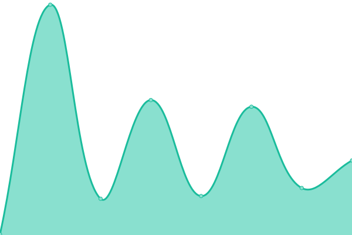 170ms
     
 | 

<a href="https://qwertydev1.github.io/rammerhead-uptime/history/rammerhead2">100.00%</a>
    

|  [rammerhead3](https://ram.thefemboy.gay/) | 🟥 Down | [rammerhead3.yml](https://github.com/tuxedoware/rammerhead-uptime/commits/HEAD/history/rammerhead3.yml) | 

 294ms
     
 | 

<a href="https://qwertydev1.github.io/rammerhead-uptime/history/rammerhead3">100.00%</a>
    

|  [rammerhead4](https://browser.rammerhead.org/) | 🟥 Down | [rammerhead4.yml](https://github.com/tuxedoware/rammerhead-uptime/commits/HEAD/history/rammerhead4.yml) | 

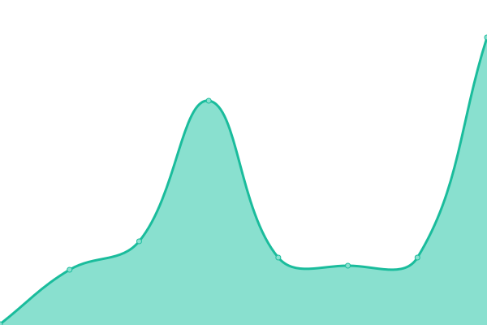 77ms
     
 | 

<a href="https://qwertydev1.github.io/rammerhead-uptime/history/rammerhead4">100.00%</a>
    

|  [rammerhead5](https://rammerhead.midnightofficial.xyz/) | 🟥 Down | [rammerhead5.yml](https://github.com/tuxedoware/rammerhead-uptime/commits/HEAD/history/rammerhead5.yml) | 

 135ms
     
 | 

<a href="https://qwertydev1.github.io/rammerhead-uptime/history/rammerhead5">100.00%</a>
    

|  [rammerhead6](https://a.midnightofficial.xyz/) | 🟥 Down | [rammerhead6.yml](https://github.com/tuxedoware/rammerhead-uptime/commits/HEAD/history/rammerhead6.yml) | 

 170ms
     
 | 

<a href="https://qwertydev1.github.io/rammerhead-uptime/history/rammerhead6">100.00%</a>
    

|  [rammerhead7](https://r.midnightofficial.xyz/) | 🟥 Down | [rammerhead7.yml](https://github.com/tuxedoware/rammerhead-uptime/commits/HEAD/history/rammerhead7.yml) | 

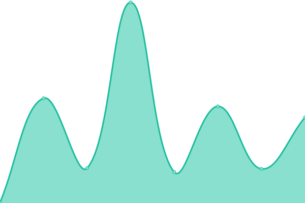 108ms
     
 | 

<a href="https://qwertydev1.github.io/rammerhead-uptime/history/rammerhead7">100.00%</a>
    

|  [rammerhead8](https://e.midnightofficial.xyz/) | 🟥 Down | [rammerhead8.yml](https://github.com/tuxedoware/rammerhead-uptime/commits/HEAD/history/rammerhead8.yml) | 

 199ms
     
 | 

<a href="https://qwertydev1.github.io/rammerhead-uptime/history/rammerhead8">100.00%</a>
    

|  [rammerhead9](https://rh.midnightofficial.xyz/) | 🟥 Down | [rammerhead9.yml](https://github.com/tuxedoware/rammerhead-uptime/commits/HEAD/history/rammerhead9.yml) | 

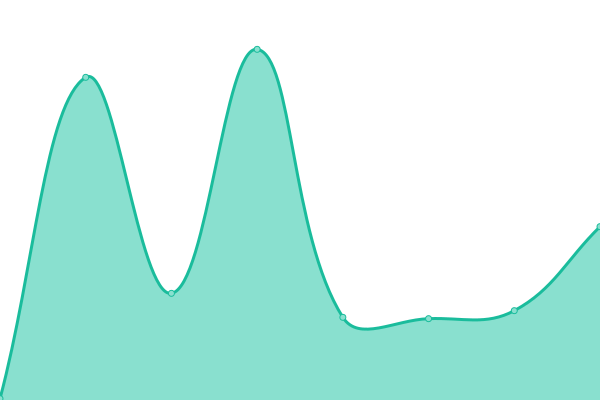 141ms
     
 | 

<a href="https://qwertydev1.github.io/rammerhead-uptime/history/rammerhead9">100.00%</a>
    

|  [rammerhead10](https://r.lucidofficial.xyz/) | 🟥 Down | [rammerhead10.yml](https://github.com/tuxedoware/rammerhead-uptime/commits/HEAD/history/rammerhead10.yml) | 

 144ms
     
 | 

<a href="https://qwertydev1.github.io/rammerhead-uptime/history/rammerhead10">100.00%</a>
    

|  [rammerhead11](https://r.apexhcf.xyz/) | 🟥 Down | [rammerhead11.yml](https://github.com/tuxedoware/rammerhead-uptime/commits/HEAD/history/rammerhead11.yml) | 

 0ms
     
 | 

<a href="https://qwertydev1.github.io/rammerhead-uptime/history/rammerhead11">100.00%</a>
    

|  [rammerhead12](https://r.kahoot.click/) | 🟥 Down | [rammerhead12.yml](https://github.com/tuxedoware/rammerhead-uptime/commits/HEAD/history/rammerhead12.yml) | 

 0ms
     
 | 

<a href="https://qwertydev1.github.io/rammerhead-uptime/history/rammerhead12">100.00%</a>
    

|  [rammerhead13](https://r.pyro.bar/) | 🟥 Down | [rammerhead13.yml](https://github.com/tuxedoware/rammerhead-uptime/commits/HEAD/history/rammerhead13.yml) | 

 0ms
     
 | 

<a href="https://qwertydev1.github.io/rammerhead-uptime/history/rammerhead13">100.00%</a>
    

|  [rammerhead14](https://sso.prodigygame.online/) | 🟥 Down | [rammerhead14.yml](https://github.com/tuxedoware/rammerhead-uptime/commits/HEAD/history/rammerhead14.yml) | 

 163ms
     
 | 

<a href="https://qwertydev1.github.io/rammerhead-uptime/history/rammerhead14">100.00%</a>
    

|  [rammerhead15](https://rm.triway.live/) | 🟥 Down | [rammerhead15.yml](https://github.com/tuxedoware/rammerhead-uptime/commits/HEAD/history/rammerhead15.yml) | 

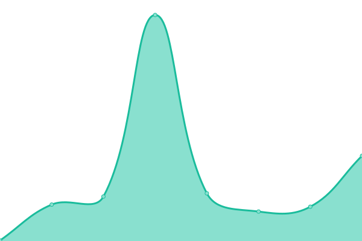 131ms
     
 | 

<a href="https://qwertydev1.github.io/rammerhead-uptime/history/rammerhead15">100.00%</a>
    

|  [rammerhead16](https://afsgderdfegtdfsewrdfserdgcvxdsfegrfbcv.ruralanemone.tech/) | 🟥 Down | [rammerhead16.yml](https://github.com/tuxedoware/rammerhead-uptime/commits/HEAD/history/rammerhead16.yml) | 

 0ms
     
 | 

<a href="https://qwertydev1.github.io/rammerhead-uptime/history/rammerhead16">100.00%</a>
    

|  [rammerhead17](https://yee.ruralanemone.tech/) | 🟥 Down | [rammerhead17.yml](https://github.com/tuxedoware/rammerhead-uptime/commits/HEAD/history/rammerhead17.yml) | 

 0ms
     
 | 

<a href="https://qwertydev1.github.io/rammerhead-uptime/history/rammerhead17">100.00%</a>
    

|  [rammerhead18](https://xmr.luph.cc/) | 🟥 Down | [rammerhead18.yml](https://github.com/tuxedoware/rammerhead-uptime/commits/HEAD/history/rammerhead18.yml) | 

 143ms
     
 | 

<a href="https://qwertydev1.github.io/rammerhead-uptime/history/rammerhead18">100.00%</a>
    

|  [rammerhead19](https://use.matrix.luph.lol/) | 🟥 Down | [rammerhead19.yml](https://github.com/tuxedoware/rammerhead-uptime/commits/HEAD/history/rammerhead19.yml) | 

 158ms
     
 | 

<a href="https://qwertydev1.github.io/rammerhead-uptime/history/rammerhead19">100.00%</a>
    

|  [rammerhead20](https://r.generalmathematics.net/) | 🟥 Down | [rammerhead20.yml](https://github.com/tuxedoware/rammerhead-uptime/commits/HEAD/history/rammerhead20.yml) | 

 123ms
     
 | 

<a href="https://qwertydev1.github.io/rammerhead-uptime/history/rammerhead20">100.00%</a>
    

|  [rammerhead21](https://legit.studyschooltoday.eu.org/) | 🟥 Down | [rammerhead21.yml](https://github.com/tuxedoware/rammerhead-uptime/commits/HEAD/history/rammerhead21.yml) | 

 213ms
     
 | 

<a href="https://qwertydev1.github.io/rammerhead-uptime/history/rammerhead21">100.00%</a>
    

|  [rammerhead22](https://sussybaka.studyschooltoday.eu.org/) | 🟥 Down | [rammerhead22.yml](https://github.com/tuxedoware/rammerhead-uptime/commits/HEAD/history/rammerhead22.yml) | 

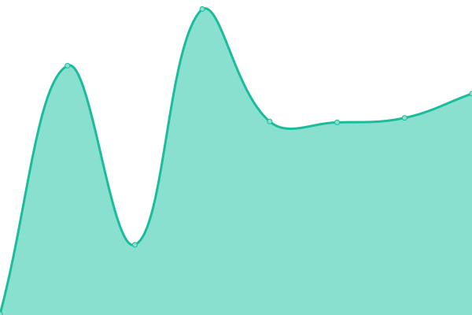 218ms
     
 | 

<a href="https://qwertydev1.github.io/rammerhead-uptime/history/rammerhead22">100.00%</a>
    

|  [rammerhead23](https://pickmysubdomaininchat.studyschooltoday.eu.org/) | 🟥 Down | [rammerhead23.yml](https://github.com/tuxedoware/rammerhead-uptime/commits/HEAD/history/rammerhead23.yml) | 

 187ms
     
 | 

<a href="https://qwertydev1.github.io/rammerhead-uptime/history/rammerhead23">100.00%</a>
    

|  [rammerhead24](https://my.name.is.john.cenaa.studyschooltoday.eu.org/) | 🟥 Down | [rammerhead24.yml](https://github.com/tuxedoware/rammerhead-uptime/commits/HEAD/history/rammerhead24.yml) | 

 0ms
     
 | 

<a href="https://qwertydev1.github.io/rammerhead-uptime/history/rammerhead24">100.00%</a>
    

|  [rammerhead25](https://r.utopia.education/) | 🟥 Down | [rammerhead25.yml](https://github.com/tuxedoware/rammerhead-uptime/commits/HEAD/history/rammerhead25.yml) | 

 252ms
     
 | 

<a href="https://qwertydev1.github.io/rammerhead-uptime/history/rammerhead25">100.00%</a>
    

|  [rammerhead26](https://r.utopiaunblocker.org/) | 🟥 Down | [rammerhead26.yml](https://github.com/tuxedoware/rammerhead-uptime/commits/HEAD/history/rammerhead26.yml) | 

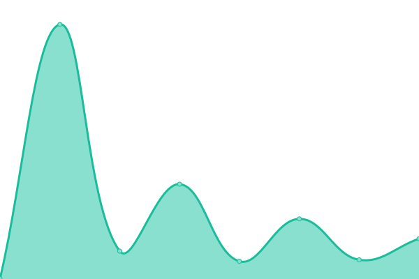 202ms
     
 | 

<a href="https://qwertydev1.github.io/rammerhead-uptime/history/rammerhead26">100.00%</a>
    

|  [rammerhead27](https://r.utopiaworld.ink/) | 🟥 Down | [rammerhead27.yml](https://github.com/tuxedoware/rammerhead-uptime/commits/HEAD/history/rammerhead27.yml) | 

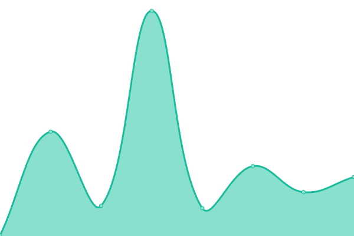 229ms
     
 | 

<a href="https://qwertydev1.github.io/rammerhead-uptime/history/rammerhead27">100.00%</a>
    

|  [rammerhead28](https://rh.aluminumnetwork.xyz/) | 🟥 Down | [rammerhead28.yml](https://github.com/tuxedoware/rammerhead-uptime/commits/HEAD/history/rammerhead28.yml) | 

 0ms
     
 | 

<a href="https://qwertydev1.github.io/rammerhead-uptime/history/rammerhead28">100.00%</a>
    

|  [rammerhead29](https://r.aluminumnetwork.xyz/) | 🟥 Down | [rammerhead29.yml](https://github.com/tuxedoware/rammerhead-uptime/commits/HEAD/history/rammerhead29.yml) | 

 0ms
     
 | 

<a href="https://qwertydev1.github.io/rammerhead-uptime/history/rammerhead29">100.00%</a>
    

|  [rammerhead30](https://r.weeb-central.icu/) | 🟥 Down | [rammerhead30.yml](https://github.com/tuxedoware/rammerhead-uptime/commits/HEAD/history/rammerhead30.yml) | 

 126ms
     
 | 

<a href="https://qwertydev1.github.io/rammerhead-uptime/history/rammerhead30">100.00%</a>
    

|  [rammerhead31](https://direct.weeb-central.icu/) | 🟥 Down | [rammerhead31.yml](https://github.com/tuxedoware/rammerhead-uptime/commits/HEAD/history/rammerhead31.yml) | 

 140ms
     
 | 

<a href="https://qwertydev1.github.io/rammerhead-uptime/history/rammerhead31">100.00%</a>
    

|  [rammerhead32](https://rh.weeb-central.icu/) | 🟥 Down | [rammerhead32.yml](https://github.com/tuxedoware/rammerhead-uptime/commits/HEAD/history/rammerhead32.yml) | 

 110ms
     
 | 

<a href="https://qwertydev1.github.io/rammerhead-uptime/history/rammerhead32">100.00%</a>
    

|  [rammerhead33](https://ram.weeb-central.icu/) | 🟥 Down | [rammerhead33.yml](https://github.com/tuxedoware/rammerhead-uptime/commits/HEAD/history/rammerhead33.yml) | 

 149ms
     
 | 

<a href="https://qwertydev1.github.io/rammerhead-uptime/history/rammerhead33">100.00%</a>
    

|  [rammerhead34](https://sso.weeb-central.icu/) | 🟥 Down | [rammerhead34.yml](https://github.com/tuxedoware/rammerhead-uptime/commits/HEAD/history/rammerhead34.yml) | 

 94ms
     
 | 

<a href="https://qwertydev1.github.io/rammerhead-uptime/history/rammerhead34">100.00%</a>
    

|  [rammerhead35](https://r.studyschooltoday.eu.org/) | 🟥 Down | [rammerhead35.yml](https://github.com/tuxedoware/rammerhead-uptime/commits/HEAD/history/rammerhead35.yml) | 

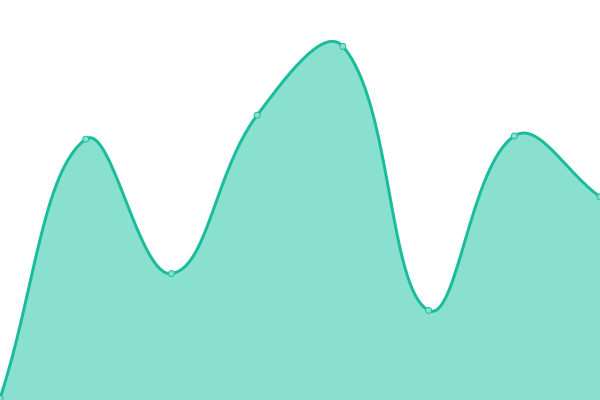 214ms
     
 | 

<a href="https://qwertydev1.github.io/rammerhead-uptime/history/rammerhead35">100.00%</a>
    

|  [rammerhead36](https://desp.icable.me/) | 🟥 Down | [rammerhead36.yml](https://github.com/tuxedoware/rammerhead-uptime/commits/HEAD/history/rammerhead36.yml) | 

 85ms
     
 | 

<a href="https://qwertydev1.github.io/rammerhead-uptime/history/rammerhead36">100.00%</a>
    

|  [rammerhead37](https://bananaboat.me/) | 🟥 Down | [rammerhead37.yml](https://github.com/tuxedoware/rammerhead-uptime/commits/HEAD/history/rammerhead37.yml) | 

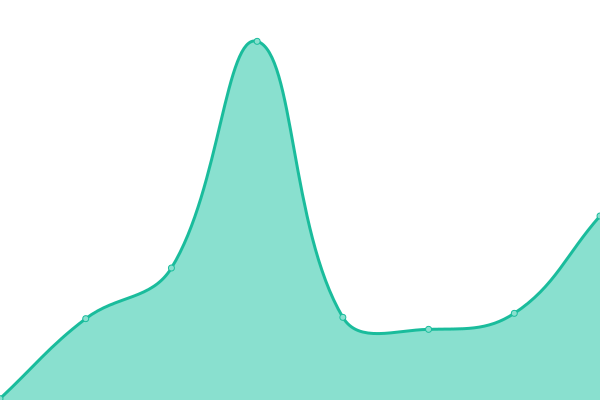 124ms
     
 | 

<a href="https://qwertydev1.github.io/rammerhead-uptime/history/rammerhead37">100.00%</a>
    

|  [rammerhead38](https://rammer.camdvr.org/) | 🟥 Down | [rammerhead38.yml](https://github.com/tuxedoware/rammerhead-uptime/commits/HEAD/history/rammerhead38.yml) | 

 200ms
     
 | 

<a href="https://qwertydev1.github.io/rammerhead-uptime/history/rammerhead38">100.00%</a>
    

|  [rammerhead39](https://rammer.ooguy.com/) | 🟥 Down | [rammerhead39.yml](https://github.com/tuxedoware/rammerhead-uptime/commits/HEAD/history/rammerhead39.yml) | 

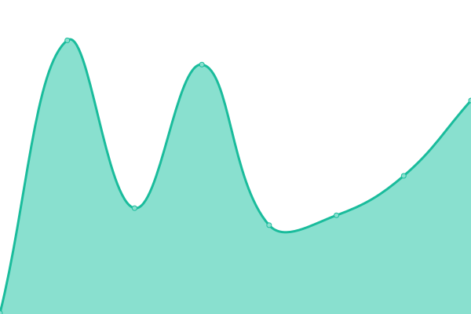 202ms
     
 | 

<a href="https://qwertydev1.github.io/rammerhead-uptime/history/rammerhead39">100.00%</a>
    

|  [rammerhead40](https://rammer.giize.com/) | 🟥 Down | [rammerhead40.yml](https://github.com/tuxedoware/rammerhead-uptime/commits/HEAD/history/rammerhead40.yml) | 

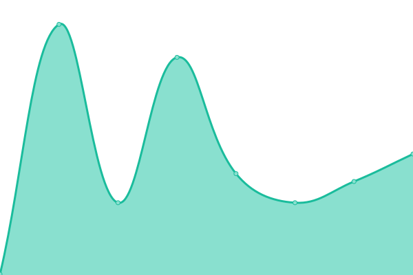 196ms
     
 | 

<a href="https://qwertydev1.github.io/rammerhead-uptime/history/rammerhead40">100.00%</a>
    

|  [rammerhead41](https://rammer.loseyourip.com/) | 🟥 Down | [rammerhead41.yml](https://github.com/tuxedoware/rammerhead-uptime/commits/HEAD/history/rammerhead41.yml) | 

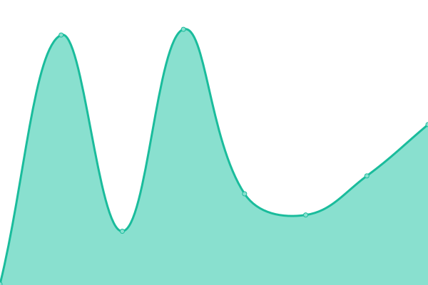 201ms
     
 | 

<a href="https://qwertydev1.github.io/rammerhead-uptime/history/rammerhead41">100.00%</a>
    

|  [rammerhead42](https://rh.titannetwork.info/) | 🟥 Down | [rammerhead42.yml](https://github.com/tuxedoware/rammerhead-uptime/commits/HEAD/history/rammerhead42.yml) | 

 152ms
     
 | 

<a href="https://qwertydev1.github.io/rammerhead-uptime/history/rammerhead42">100.00%</a>
    

|  [rammerhead43](https://empowerlearning.titannetwork.info/) | 🟥 Down | [rammerhead43.yml](https://github.com/tuxedoware/rammerhead-uptime/commits/HEAD/history/rammerhead43.yml) | 

 171ms
     
 | 

<a href="https://qwertydev1.github.io/rammerhead-uptime/history/rammerhead43">100.00%</a>
    

|  [rammerhead44](https://enrichingstudents.titannetwork.info/) | 🟥 Down | [rammerhead44.yml](https://github.com/tuxedoware/rammerhead-uptime/commits/HEAD/history/rammerhead44.yml) | 

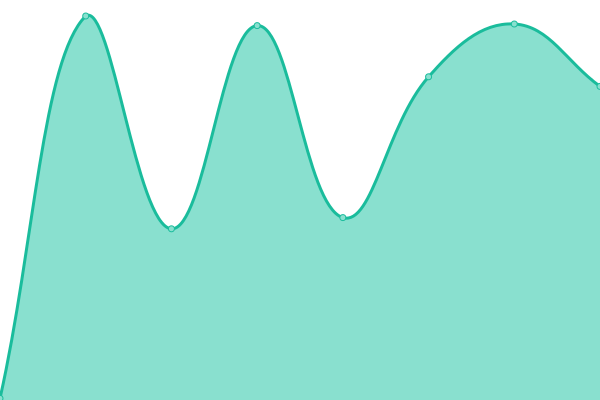 160ms
     
 | 

<a href="https://qwertydev1.github.io/rammerhead-uptime/history/rammerhead44">100.00%</a>
    

|  [rammerhead45](https://googleclassroom.titannetwork.info/) | 🟥 Down | [rammerhead45.yml](https://github.com/tuxedoware/rammerhead-uptime/commits/HEAD/history/rammerhead45.yml) | 

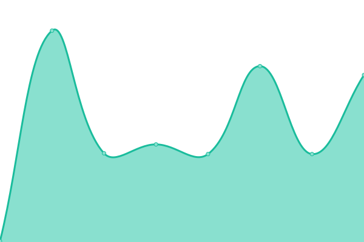 140ms
     
 | 

<a href="https://qwertydev1.github.io/rammerhead-uptime/history/rammerhead45">100.00%</a>
    

|  [rammerhead46](https://cloudflare.rammerhead.org/) | 🟥 Down | [rammerhead46.yml](https://github.com/tuxedoware/rammerhead-uptime/commits/HEAD/history/rammerhead46.yml) | 

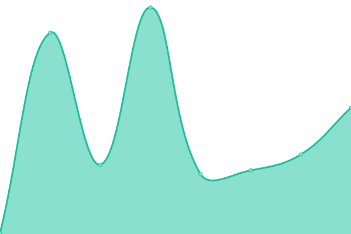 126ms
     
 | 

<a href="https://qwertydev1.github.io/rammerhead-uptime/history/rammerhead46">100.00%</a>
    

|  [rammerhead47](https://rammerhead.morrowseer.xyz/) | 🟥 Down | [rammerhead47.yml](https://github.com/tuxedoware/rammerhead-uptime/commits/HEAD/history/rammerhead47.yml) | 

 70ms
     
 | 

<a href="https://qwertydev1.github.io/rammerhead-uptime/history/rammerhead47">100.00%</a>
    

|  [rammerhead48](https://poodle.xn--unup4y/) | 🟥 Down | [rammerhead48.yml](https://github.com/tuxedoware/rammerhead-uptime/commits/HEAD/history/rammerhead48.yml) | 

 345ms
     
 | 

<a href="https://qwertydev1.github.io/rammerhead-uptime/history/rammerhead48">100.00%</a>
    

|  [rammerhead49](https://rx.blackxfiied.xyz/) | 🟥 Down | [rammerhead49.yml](https://github.com/tuxedoware/rammerhead-uptime/commits/HEAD/history/rammerhead49.yml) | 

 77ms
     
 | 

<a href="https://qwertydev1.github.io/rammerhead-uptime/history/rammerhead49">100.00%</a>
    

|  [rammerhead50](https://ram.motortruck1221.tech/) | 🟥 Down | [rammerhead50.yml](https://github.com/tuxedoware/rammerhead-uptime/commits/HEAD/history/rammerhead50.yml) | 

 75ms
     
 | 

<a href="https://qwertydev1.github.io/rammerhead-uptime/history/rammerhead50">100.00%</a>
    

|  [rammerhead51](https://rh.motortruck1221.me/) | 🟥 Down | [rammerhead51.yml](https://github.com/tuxedoware/rammerhead-uptime/commits/HEAD/history/rammerhead51.yml) | 

 84ms
     
 | 

<a href="https://qwertydev1.github.io/rammerhead-uptime/history/rammerhead51">100.00%</a>
    

|  [rammerhead52](https://rd.globalcentauri.tech/) | 🟥 Down | [rammerhead52.yml](https://github.com/tuxedoware/rammerhead-uptime/commits/HEAD/history/rammerhead52.yml) | 

 102ms
     
 | 

<a href="https://qwertydev1.github.io/rammerhead-uptime/history/rammerhead52">100.00%</a>
    

|  [rammerhead53](https://ramming.xan.lol/) | 🟥 Down | [rammerhead53.yml](https://github.com/tuxedoware/rammerhead-uptime/commits/HEAD/history/rammerhead53.yml) | 

 0ms
     
 | 

<a href="https://qwertydev1.github.io/rammerhead-uptime/history/rammerhead53">100.00%</a>
    

|  [rammerhead54](https://rh.naruto.tech/) | 🟥 Down | [rammerhead54.yml](https://github.com/tuxedoware/rammerhead-uptime/commits/HEAD/history/rammerhead54.yml) | 

 0ms
     
 | 

<a href="https://qwertydev1.github.io/rammerhead-uptime/history/rammerhead54">100.00%</a>
    

|  [rammerhead55](https://pwoxywoxy.xan.lol/) | 🟥 Down | [rammerhead55.yml](https://github.com/tuxedoware/rammerhead-uptime/commits/HEAD/history/rammerhead55.yml) | 

 136ms
     
 | 

<a href="https://qwertydev1.github.io/rammerhead-uptime/history/rammerhead55">100.00%</a>
    

|  [rammerhead56](https://rh.lhost.dev/) | 🟥 Down | [rammerhead56.yml](https://github.com/tuxedoware/rammerhead-uptime/commits/HEAD/history/rammerhead56.yml) | 

 181ms
     
 | 

<a href="https://qwertydev1.github.io/rammerhead-uptime/history/rammerhead56">100.00%</a>
    

|  [rammerhead57](https://chrome.lhost.dev/) | 🟥 Down | [rammerhead57.yml](https://github.com/tuxedoware/rammerhead-uptime/commits/HEAD/history/rammerhead57.yml) | 

 189ms
     
 | 

<a href="https://qwertydev1.github.io/rammerhead-uptime/history/rammerhead57">100.00%</a>
    

|  [rammerhead58](https://blocked.lhost.dev/) | 🟥 Down | [rammerhead58.yml](https://github.com/tuxedoware/rammerhead-uptime/commits/HEAD/history/rammerhead58.yml) | 

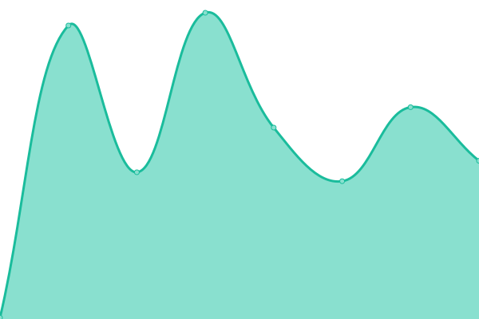 175ms
     
 | 

<a href="https://qwertydev1.github.io/rammerhead-uptime/history/rammerhead58">100.00%</a>
    

|  [rammerhead59](https://tabs.lhost.dev/) | 🟥 Down | [rammerhead59.yml](https://github.com/tuxedoware/rammerhead-uptime/commits/HEAD/history/rammerhead59.yml) | 

 168ms
     
 | 

<a href="https://qwertydev1.github.io/rammerhead-uptime/history/rammerhead59">100.00%</a>
    

|  [rammerhead60](https://r.willuna.live/) | 🟥 Down | [rammerhead60.yml](https://github.com/tuxedoware/rammerhead-uptime/commits/HEAD/history/rammerhead60.yml) | 

 586ms
     
 | 

<a href="https://qwertydev1.github.io/rammerhead-uptime/history/rammerhead60">100.00%</a>
    

|  [rammerhead61](https://direct3.rammerhead.org/) | 🟥 Down | [rammerhead61.yml](https://github.com/tuxedoware/rammerhead-uptime/commits/HEAD/history/rammerhead61.yml) | 

 0ms
     
 | 

<a href="https://qwertydev1.github.io/rammerhead-uptime/history/rammerhead61">100.00%</a>
    

|  [rammerhead62](https://rh.lwaid.dev/) | 🟥 Down | [rammerhead62.yml](https://github.com/tuxedoware/rammerhead-uptime/commits/HEAD/history/rammerhead62.yml) | 

 475ms
     
 | 

<a href="https://qwertydev1.github.io/rammerhead-uptime/history/rammerhead62">100.00%</a>
    

|  [rammerhead63](https://direct4.rammerhead.org/) | 🟥 Down | [rammerhead63.yml](https://github.com/tuxedoware/rammerhead-uptime/commits/HEAD/history/rammerhead63.yml) | 

 0ms
     
 | 

<a href="https://qwertydev1.github.io/rammerhead-uptime/history/rammerhead63">100.00%</a>
    

|  [rammerhead64](https://direct5.rammerhead.org/) | 🟥 Down | [rammerhead64.yml](https://github.com/tuxedoware/rammerhead-uptime/commits/HEAD/history/rammerhead64.yml) | 

 118ms
     
 | 

<a href="https://qwertydev1.github.io/rammerhead-uptime/history/rammerhead64">100.00%</a>
    

|  [rammerhead65](https://rammerhead.yitzib.me/) | 🟥 Down | [rammerhead65.yml](https://github.com/tuxedoware/rammerhead-uptime/commits/HEAD/history/rammerhead65.yml) | 

 0ms
     
 | 

<a href="https://qwertydev1.github.io/rammerhead-uptime/history/rammerhead65">100.00%</a>
    

|  [rammerhead66](https://not.my.actual.name.yitzib.me/) | 🟥 Down | [rammerhead66.yml](https://github.com/tuxedoware/rammerhead-uptime/commits/HEAD/history/rammerhead66.yml) | 

 0ms
     
 | 

<a href="https://qwertydev1.github.io/rammerhead-uptime/history/rammerhead66">100.00%</a>
    

|  [rammerhead67](https://r.yitzib.me/) | 🟥 Down | [rammerhead67.yml](https://github.com/tuxedoware/rammerhead-uptime/commits/HEAD/history/rammerhead67.yml) | 

 0ms
     
 | 

<a href="https://qwertydev1.github.io/rammerhead-uptime/history/rammerhead67">100.00%</a>
    

|  [rammerhead68](https://im.not.r.aci.st/) | 🟥 Down | [rammerhead68.yml](https://github.com/tuxedoware/rammerhead-uptime/commits/HEAD/history/rammerhead68.yml) | 

 273ms
     
 | 

<a href="https://qwertydev1.github.io/rammerhead-uptime/history/rammerhead68">100.00%</a>
    

|  [rammerhead69](https://breadtw.ink/) | 🟥 Down | [rammerhead69.yml](https://github.com/tuxedoware/rammerhead-uptime/commits/HEAD/history/rammerhead69.yml) | 

 1392ms
     
 | 

<a href="https://qwertydev1.github.io/rammerhead-uptime/history/rammerhead69">94.02%</a>
    

|  [rammerhead70](https://against.the.gra.im/) | 🟥 Down | [rammerhead70.yml](https://github.com/tuxedoware/rammerhead-uptime/commits/HEAD/history/rammerhead70.yml) | 

 0ms
     
 | 

<a href="https://qwertydev1.github.io/rammerhead-uptime/history/rammerhead70">100.00%</a>
    

|  [rammerhead71](https://r.il.ax/) | 🟥 Down | [rammerhead71.yml](https://github.com/tuxedoware/rammerhead-uptime/commits/HEAD/history/rammerhead71.yml) | 

 242ms
     
 | 

<a href="https://qwertydev1.github.io/rammerhead-uptime/history/rammerhead71">100.00%</a>
    

|  [rammerhead72](https://link2.viewdns.net/) | 🟥 Down | [rammerhead72.yml](https://github.com/tuxedoware/rammerhead-uptime/commits/HEAD/history/rammerhead72.yml) | 

 0ms
     
 | 

<a href="https://qwertydev1.github.io/rammerhead-uptime/history/rammerhead72">100.00%</a>
    

|  [rammerhead73](https://rammerhead.izooc.ninja/) | 🟥 Down | [rammerhead73.yml](https://github.com/tuxedoware/rammerhead-uptime/commits/HEAD/history/rammerhead73.yml) | 

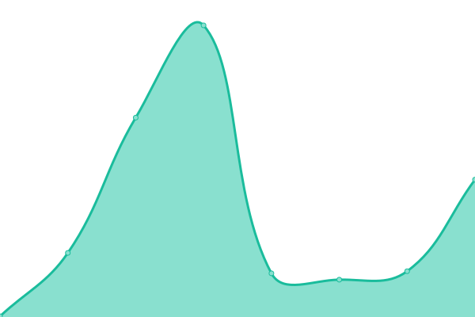 103ms
     
 | 

<a href="https://qwertydev1.github.io/rammerhead-uptime/history/rammerhead73">100.00%</a>
    

<!--end: status pages-->

[**Visit our status website →**](https://qwertydev1.github.io/rammerhead-uptime)

## 📄 License

- Powered by: [Upptime](https://github.com/upptime/upptime)
- Code: [MIT](./LICENSE) © [qwertyhtml](https://qwertydev1.github.io/rammerhead-uptime)
- Data in the `./history` directory: [Open Database License](https://opendatacommons.org/licenses/odbl/1-0/)
